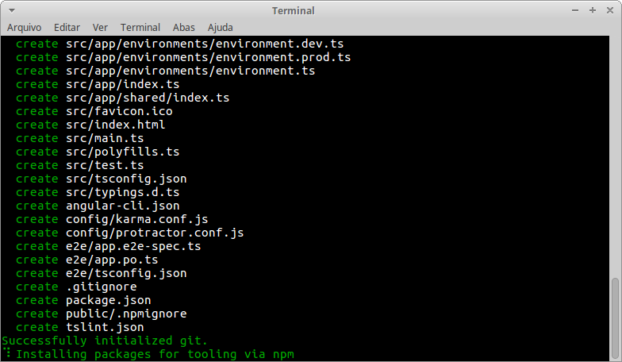
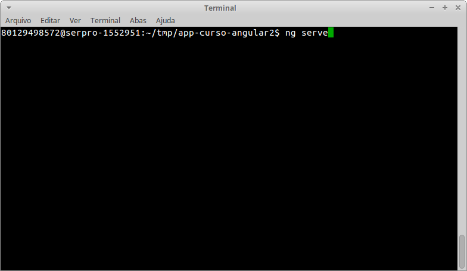
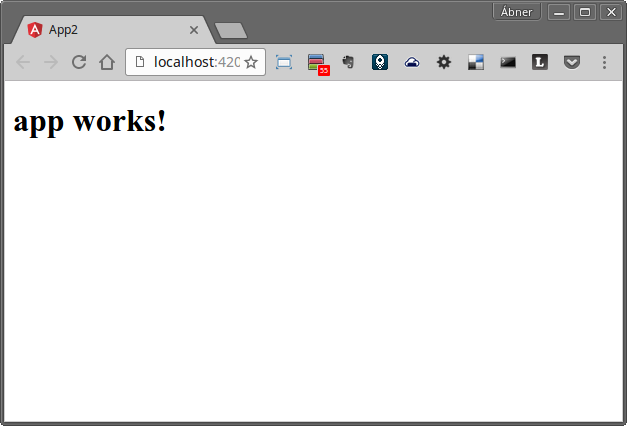

# Aula 1 - Passo a Passo

## Criando nossa primeira aplicação Angular 2

#### Instale o Node JS e o Visual Studio Code utilizandos os passos encontrados nas páginas a seguir:

* <a href="https://git.serpro/angular/curso-angular2/wikis/instalando-o-nodejs" target="_blank">Instalando o NodeJS</a>

* <a href="https://git.serpro/angular/curso-angular2/wikis/vs-code" target="_blank">Instalando o Visual Studio Code</a>


### Instalação do utilitário angular-cli:

No terminal de linha de comando digite:

```bash
npm install -g angular/angular-cli#9188ea2
```

Após instalado, o utilitário `ng` estará disponível no PATH, possibilitando a execução do `ng`.


### Crie um projeto Angular 2 utilizando o angular-cli:

Na linha de comando, navegue para a pasta onde deseja criar o projeto e então digite:

```bash
ng new  app-curso-angular2
```

A pasta `app-curso-angular2` será criada e o npm install será executado para baixar as dependências necessárias à aplicação Angular 2.

Este passo poderá demorar alguns minutos.

Você visualizará algo similar à imagem a seguir no seu terminal.



> Antes de testar vamos precisar atualizar a versão do angular-cli definida como dependência para nosso projeto. Este passo é necessário nas versões beta do Angular-Cli.

Digite no terminal:

```bash
npm install --save-dev angular/angular-cli#9188ea2
```

Agora já podemos testar a aplicação Angular 2 gerada:

Navegue para a pasta do projeto: 

```bash
cd app-curso-angular2
```

e  digite o comando `ng serve` e pressione **ENTER &#11168;**:

    

 
 O angular-cli inicializa um servidor web na porta 4200:

 Acesse o endereço <a href="http://localhost:4200" target="_blank">http://localhost:4200</a> para ver a aplicação Angular 2 funcionando no navegador.


 Você vai ver uma tela como a seguir:
 
 

> Bem modesta a tela né! Você deve estar se perguntando: "É isso que é o Angular 2?" 
Calma aí! É apenas o começo! [:D]

Se essa tela pode ser visualizada corretamente no seu navegador, então sua aplicação Angular 2 está criada e agora poderemos abrí-la em um editor e começaremos a aprender mais sobre o Angular 2.
