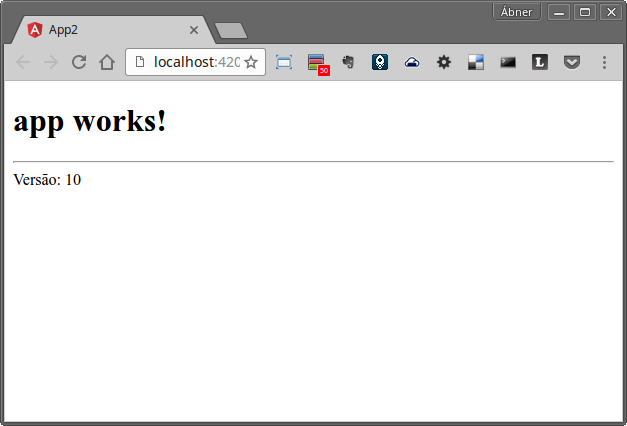
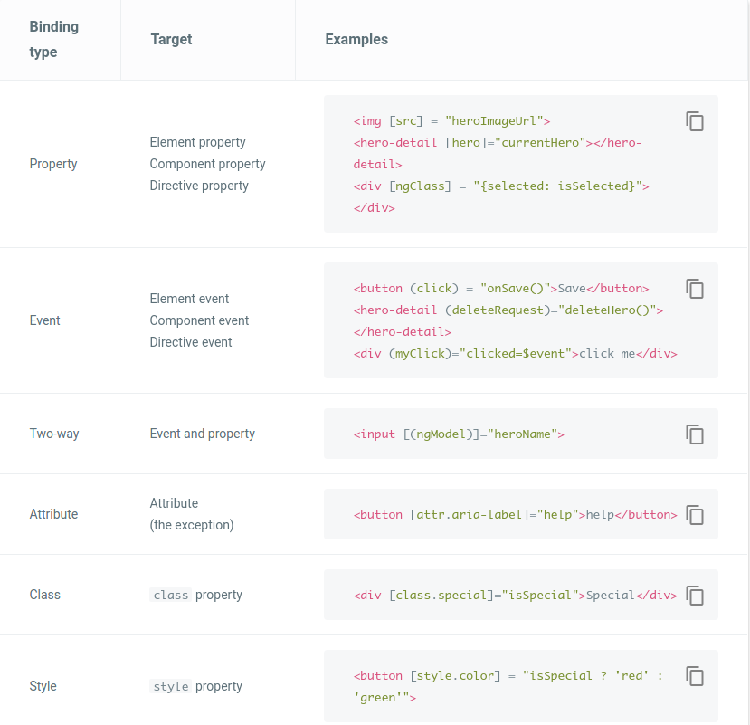

# Aula 1 - Passo a Passo

## Criando nossa primeira aplicação Angular 2

#### Instale o Node JS e o Visual Studio Code utilizandos os passos encontrados nas páginas a seguir:

* <a href="https://git.serpro/angular/curso-angular2/wikis/instalando-o-nodejs" target="_blank">Instalando o NodeJS</a>

* <a href="https://git.serpro/angular/curso-angular2/wikis/vs-code" target="_blank">Instalando o Visual Studio Code</a>


### Instalação do utilitário angular-cli:

No terminal de linha de comando digite:

```bash
npm install -g angular/angular-cli#9188ea2
```

Após instalado, o utilitário `ng` estará disponível no PATH, possibilitando a execução do `ng`.


### Crie um projeto Angular 2 utilizando o angular-cli:

Na linha de comando, navegue para a pasta onde deseja criar o projeto e então digite:

```bash
ng new  app-curso-angular2
```

A pasta `app-curso-angular2` será criada e o npm install será executado para baixar as dependências necessárias à aplicação Angular 2.

Este passo poderá demorar alguns minutos.

Você visualizará algo similar à imagem a seguir no seu terminal.


> Antes de testar vamos precisar atualizar a versão do angular-cli definida como dependência para nosso projeto. Este passo é necessário nas versões beta do Angular-Cli.

Digite no terminal:

```bash
npm install --save-dev angular/angular-cli#9188ea2
```

Agora já podemos testar a aplicação Angular 2 gerada:

Navegue para a pasta do projeto: 

```bash
cd app-curso-angular2
```

e  digite o comando `ng serve` e pressione **ENTER &#11168;**:

    

 
 O angular-cli inicializa um servidor web na porta 4200:

 Acesse o endereço <a href="http://localhost:4200" target="_blank">http://localhost:4200</a> para ver a aplicação Angular 2 funcionando no navegador.


 Você vai ver uma tela como a seguir:
 
 

> Bem modesta a tela né! Você deve estar se perguntando: "É isso que é o Angular 2?" 
Calma aí! É apenas o começo! :smile:

Se essa tela pode ser visualizada corretamente no seu navegador, então sua aplicação Angular 2 está criada e agora poderemos abrí-la em um editor e começaremos a aprender mais sobre o Angular 2.


## Estrutura da Aplicação Angular 2

- NgModule

- Componentes

- Inicialização

- Serviços

- Views / Templates

 
## Raio-X de um Componente

- A classe e o metadado @Component

- A view (template e templateUrl)

### Expressões de Template

Você pode adicionar expressões de template solto como o conteúdo do html:

```typescript
{{1 + 1}}
```

E também, entre aspas à direita de um símbolo `=` em um binding de atributo:

```html
[property]=""
```

As expressões de template são escritas em uma linguagem muito próxima ao Javascipt. Algumas expressões Javascript que podem promover efeitos colaterais são proíbidas, tais como:

* atribuições (`=`, `+=`, `-=`, dentre outras);

* `new`;

* expressões encadeadas com `;` ou `,`;

* operadores de incremento ou decremento: `++` ou `--`

Outras diferenças importantes são:

* não há suporte para operações de bits `|` e `&`

* a adição dos seguintes operadores de expressões:

 - `|`   -> O operador Pipe

 ```
 <div>Data de Nascimento: {{ dataNascimento | date:'longDate'}}</div>
 ```

O operador Pipe já é conhecido de desenvolvedores de AngularJS. Basicamente pipes são funções de transformação, que recebem um dado de entrada, processam e retornam o valor processado.
No exemplo acima, o pipe `date` está recebendo uma data e a expressão de template gerada será a string da data informada formatada em um formato longo (ex: "Fevereiro 25, 1970") 
 
 - ` ?.` -> O operador de navegação segura em objetos

 ```
O nome do usuário é {{usuario?.nome}}
 ```

O operado de navegação segura serve como proteção contra erros do tipo `"cannot read property 'nome' of null".

No exemplo acima, caso o usuario seja null a renderização da view do componente não será comprometida, uma vez que a expressão automaticamente checa se o objeto é null e retorna '' (Blank) caso positivo.


#### Contexto das Expressões

As expressões de template não podem referenciar nada do contexto global. Ou seja, não se pode chamar `console.log`, `window.alert`, `Math.max` ou qualquer outro valor.
O contexto das expressões de template estão restritos geralmente à instância do componente corrente.

Dessa forma, dado que temos um componente como o que vemos à seguir:

```typescript
import { Component } from '@angular/core';

@Component({
    selector: 'app-root',
    templateUrl: './app.component.html'
})
export class AppComponent {
    titulo: string = 'Minha Aplicação';
    versao: number = 10;
}
```

E o template é: 

```html
<h1>{{titulo}}</h1>
<hr />
Versão: {{versao}}
```

Então é esperado, que o html resultante da renderização desse componente será:



> As expressões também podem referenciar uma *`variável de referência de template`. Veremos mais sobre a *`variável de referência de template`* em breve.


### Template statements

Um "template statement" responde a eventos lançados pelo elemento alvo, que pode ser um elemento html, um componente ou uma diretiva:

Dado o exemplo a seguir:

```typescript
import { Component } from '@angular/core';

@Component({
    selector: 'app-root',
    templateUrl: './app.component.html'
})
export class AppComponent {
    titulo: string = 'Minha Aplicação';
    versao: number = 10;

    incrementarVersao() {
        this.versao += 1;
    }
}
```

E o template é: 

```html
<h1>{{titulo}}</h1>
<hr />
Versão: {{versao}}

<p>
<button type="button" (click)="incrementarVersao()">Incrementar Versão</button>  
</p>
```

Template statements são livres para alterar dados na instância do componente. Eles também se parecem muito com Javascript. 
O parser de template statements permitem atribuições básicas e encadeamento de expressões com `,` e `;`.

Não são permitidos:

* `new`

* operadores de incremento ou decremento: `++` ou `--`;

* operadores de atribuição (`+=`, `-=`);

* não há suporte para operações de bits `|` e `&`;

* e operadores de expressões: `|` e `?.`.


> Assim como as **`expressões`** os statements executam no contexto da instância do componente. E as mesmas restrições à objetos globais se aplicam.

> Os statements também podem referenciar uma *`variável de referência de template`*. Veremos mais sobre a variável de *`referência de template`* em breve.


### Syntax de Binding

O quadro a seguir resume as sintaxes possíveis para data-binding no Angular 2 

| Data Direction                                     |  Syntax                                                                 |  Binding Type                                                |
|:--                                                 |:--                                                                      |:--                                                           |
| Uma via<br/>do model<br/> para a view |  `{{expressão}}`<br>`[target]="expressão"`<br>`bind-target="expressão"`    |  Interpolação<br>Propriedade<br>Atributo<br>Classe<br/>Estilo   |   
| Uma via <br/>Da view para o model |  `(target)="statement`"<br>`on-target="statement"`    |  Event |
| Duas vias |  `[(target)]="expression"`    |  Duas vias | 
	
Como podemos ver os bindings, com excessão expressões de interpolação, possuem um target (alvo). E o que são esses targets?

Os alvos do data-binding do Angular 2 não são atributos HTML, estritamente falando. Por quê? Por que os atributos html são utilizados pelos navegadores apenas para inicializar valores no DOM do elemento HTML.

Vamos fazer o seguinte exercício:

Acessem o <a href="https://plnkr.co/edit/">plunkr</a> e adicionem no HTML o seguinte elemento>:

```
<input type="text" id="nome" value="Joao">

<button onClick="alterarPropriedade()">Alterar propriedade value</button>
```

Agora no javascript vamos manipular a propriedade value do elemento  para "Joaquim".

Adicione o javascript abaixo no arquivo `script.js`. 

```javascript
function alterarPropriedade() {
  document.getElementById('nome').value = 'Joaquim';
  alert('Atributo Value = ' + document.getElementById('nome').getAttribute('value'));
}
```

Agora clique no botão `Run`.

> Veremos que efetivamente elemento terá sua propriedade value alterada para `Joaquim`. No entanto o HTML permanecerá com o value 'João'.

A diferença basicamente é a seguinte: 

O *atributo* value define o valor inicial. A *propriedade* `value` do DOM  referencia o valor atual e permite atualizá-lo.

> É crucial salientar esta diferença uma vez que os templates bindings dizem respeito à propriedades e eventos, não a atributos. (Há uma rara exceção que iremos mostrar a seguir, mas que inclusive possui uma sintaxe particular)

### Alvos dos Data-Bindings

A tabela a seguir resume os tipos de bindings e os alvos:




### Bindings na prática:


Vamos agora, ver alguns exemplos de código com interpolação e bindings para fixarmos o entendimento destes conceitos:


#### Observações gerais sobre bindings:

- Lembre sempre dos colchetes. Se esquecermos os colchetes, o Angular2 assume que o valor que está sendo passado é uma string e não uma expressão que deverá ser processada.

> Podemos utilizar a definição de property sem o colchete nos seguintes casos:
* A propriedade alvo aceita uma string e queremos passar uma constante pra ela;
* Não há expectativa que essa string passada venha a sofrer alterações 

#### Binding de propriedade ou Interpolação

Em muitas situações podemos escolher entre usar interpolação ou binding:

```html
<h1 [innerText]="titulo"></h1>
```

ou 

```html
<h1 innerText="{{titulo}}"></h1>
```

As duas formas funcionam da mesma forma. A decisão sobre qual usar deve dizer respeito a uma escolha mais de estilo. O interessante, nesse caso é escolher um estilo e seguí-lo para facilitar a compreensão.


### Bindings de atributos

Alguns atributos não possuem propriedades correspondentes. Como é o caso da propriedade colspan do elemento `TD`, que no HTML representa a coluna de uma linha de uma tabela.
E em alguns casos queremos definí-los programaticamente. Nesse caso, existe a seguinte sintax possível:

```typescript
import { Component } from '@angular/core';

@Component({
  selector: 'app-root',
  templateUrl: 'app.component.html',
  styleUrls: ['app.component.css']
})
export class AppComponent {
  title = 'app works!';
  versao: number = 10;
  tdColspan: number = 1;
}
```

```html
<input type="number" [(ngModel)]="tdColspan"></input>
<table border=1>
  <!--  expressão está definida na  instância do componente como 1 por conta da inicialização da classe -->
  <tr><td [attr.colspan]="tdColspan">One-Two</td></tr>
  <!-- ERROR: There is no `colspan` property to set!
    <tr><td colspan="{{1 + 1}}">Three-Four</td></tr>
  -->
  <tr><td>Five</td><td>Six</td></tr>
</table>
```

### NgModel explicado

```html
<input [value]="currentHero.firstName"
       (input)="currentHero.firstName=$event.target.value" >
```

```html
<input
  [ngModel]="currentHero.firstName"
  (ngModelChange)="currentHero.firstName=$event">
```

```html
<input [(ngModel)]="currentHero.firstName">
```

> ```[(ngModel)]``` é um exemplo específico de um padrão geral no qual o Angular 2 "decompõe" a sintaxe [(x)]  em uma propriedade de binding  `x`  e um bind de statement para um evento `xChange`. <br/><br/>O Angular constrói uma statement para a propriedade de evento adicionando o `=$event` para a literal `x` da expressão de template.<br/><br/> ```[(x)]="e" <==> [x]="e" (xChange)="e=$event"```<p>Nós podemos escrever uma diretiva de duas vias utilizando esse mesmo padrão.</p>


### Diretivas internas do Angular2

Muitas coisas no Angular 2 não são mais construídas com diretivas. Diretivas como ng-click por exemplo não são mais necessárias, por conta dessa sintaxe de bindings a eventos.

No entanto ainda existem algumas diretivas que facilitam algumas tarefas.

#### NgClass ->  permite controlar dinâmicamente a adição e remoção de múltiplas classes css a um elemento da página

##### Exemplo 1

```typescript
@Component({
    selector: 'app-root',
    template: 'app.component.html
})
export class AppComponent {
    isSpecial: boolean = true;
}
```

```html
<div [class.special]="isSpecial">The class binding is special</div>
```

> A classe css special é adicionada à div caso o valor da variável boolean isSpecial seja true.

##### Exemplo 2 

```typescript
getClasses() {
  let classes =  {
    saveable: true,
    modified: false,
    special: isSpecial
  };
  return classes;
}
```

```html
<div [ngClass]="getClasses()">This div is saveable and special</div>
```

#### NgStyle

##### Exemplo 1

```html
<div [style.font-size]="isSpecial ? 'x-large' : 'smaller'" >
  This div is x-large.
</div>
```


##### Exemplo 2

```typescript
getStyles() {
  let styles = {
    // CSS property names
    'font-style':  'italic',
    'font-weight': 'normal',
    'font-size':   isSpecial    ? '24px'   : '8px',     // 24px
  };
  return styles;
}
```


```html
<div [ngStyle]="getStyles()">
  This div is italic, normal weight, and extra large (24px).
</div>
```

#### NgIf

**app.component.ts**
```typescript
@Component({
    selector: 'app-root',
    template: 'app.component.html
})
export class AppComponent {
    currentUser: { name: string } = { name: 'Joaquim José' };
}
```

**app.component.html**
```
<div *ngIf="currentUser">Hello, {{currentUser.name}}</div>
```

> ATENÇÃO: Visibilidade e NgIf não são a mesma coisa: No NgIf, se o valor da expressão retornar falso, o elemento que possui a diretiva ngIf não será renderizado.


##### É possível exibir e esconder um elemento utilizando os binds class e style:

```html
<!-- isSpecial is true -->
<div [class.hidden]="!isSpecial">Show with class</div>
<div [class.hidden]="isSpecial">Hide with class</div>

<!-- HeroDetail is in the DOM but hidden -->
<hero-detail [class.hidden]="isSpecial"></hero-detail>

<div [style.display]="isSpecial ? 'block' : 'none'">Show with style</div>
<div [style.display]="isSpecial ? 'none'  : 'block'">Hide with style</div>
```


#### NgFor

```
<div *ngFor="let aluno of alunos">{{aluno.nome}}</div>
```

NgFor with index

The ngFor directive supports an optional index that increases from 0 to the length of the array for each iteration. We can capture the index in a template input variable and use it in our template.

The next example captures the index in a variable named i, using it to stamp out rows like "1 - Hercules Son of Zeus".


<div *ngFor="let hero of heroes; let i=index">{{i + 1}} - {{hero.fullName}}</div>
Learn about other special index-like values such as last, even, and odd in the NgFor API reference.


#### NgForTrackBy

The ngFor directive has the potential to perform poorly, especially with large lists. A small change to one item, an item removed, or an item added can trigger a cascade of DOM manipulations.

For example, we could refresh the list of heroes by re-querying the server. The refreshed list probably contains most, if not all, of the previously displayed heroes.

We know this because the id of each hero hasn't changed. But Angular sees only a fresh list of new object references. It has no choice but to tear down the old list, discard those DOM elements, and re-build a new list with new DOM elements.

Angular can avoid this churn if we give it a tracking function that tells it what we know: that two objects with the same hero.id are the same hero. Here is such a function:


trackByHeroes(index: number, hero: Hero) { return hero.id; }
Now set the NgForTrackBy directive to that tracking function.


<div *ngFor="let hero of heroes; trackBy:trackByHeroes">({{hero.id}}) {{hero.fullName}}</div>
The tracking function doesn't eliminate all DOM changes. Angular may have to update the DOM element if the same-hero properties have changed. But if the properties haven't changed — and most of the time they will not have changed — Angular can leave those DOM elements alone. The list UI will be smoother and more responsive.

Here is an illustration of the NgForTrackBy effect.


### ngSwitch

```html
<span [ngSwitch]="faixaEtaria">
  <span *ngSwitchCase="'crianca'">Olá garotada!</span>
  <span *ngSwitchCase="'jovem'">Olá meu jovem!</span>
  <span *ngSwitchCase="'adulto'">Oi Caro amigo</span>
  <span *ngSwitchCase="'idoso'">Saudações Senhor!</span>
  <span *ngSwitchDefault>Olá!</span>
</span>
```

> Não se deve colocar asterisco (*) na frente do ngSwitch. Use property binding.

> COLOQUE asterisco (*) em frente do ngSwitchCase e ngSwitchDefault.

Justificativa para isso pode ser visto em [`* and <template>`](https://angular.io/docs/ts/latest/guide/template-syntax.html#!#star-template).

## Variáveis de referência em templates

Uma variável de referência de template referencia um elemento ou diretiva do template.

Exemplo: 

```html
<input #telefone placeholder="Digite o Telefone">
<button (click)="registrarLigacao(telefone.value)">Ligar</button>
```

O prefixo hash(#) significao que estamos definindo uma variável de referência.

Uma sintaxe alternativa é utilizar o prefixo `ref-`:

```html
<input ref-telefone placeholder="Digite o Telefone">
<button (click)="registrarLigacao(telefone.value)">Ligar</button>
```

## @Input e @Output - Databind de propriedades e eventos nos nossos próprios componentes

Aprendemos ao transcorrer desta aula a sintaxe do Angular 2 para fazermos bindings de propriedades e de eventos.

Agora vamos ver como definir propriedades e eventos em nossos próprio componentes.

O Core do Framework nos fornece dois decoradores que podemos utilizar em nossas classes de componentes que possibilitam expor nossas próprias propriedades e nossos eventos:

`@Input` e `@Output`

O @Input nos permite expor propriedades de nossos componentes que poderão assim receber ligações (data binding), permitindo que o componente contêiner de nosso componente passe valores de entrada para a propriedade do nosso componente.


Vamos ver um exemplo de um componente userBox que irá exibir informações do usuário passado via input:

**user-box.component.ts**

```typescript
import { Component, Input } from '@angular/core';

import { User } from './user.interface';
@Component({
  selector: 'user-box',
  templateUrl: './user-box.component.html',
  styleUrls: ['./user-box.scss']
})
export class UserBoxComponent {
  @Input() user: User;
}
```

**user.interface.ts**

```typescript
export interface User {
  name: string;
  email: string;
}
```

**user-box.scss**

```css
:host {
    background: none repeat scroll 0 0 #00a8b3;
    display: block;
    height: 63px;
    margin: 4px 0px 3px 0px;
}
.inbox-avatar {
    float: left;
    width: 65px;
}
.inbox-avatar img {
    border-radius: 4px;
}
.user-name {
    display: inline-block;
    margin: 0 0 0 10px;
}
.user-name h5 {
    font-size: 14px;
    font-weight: 300;
    margin-bottom: 0;
    margin-top: 15px;
}
.user-name h5 a {
    color: #fff;
}
.user-name span a {
    color: #87e2e7;
    font-size: 12px;
}
```

**user-box.html**

```html
    <a class="inbox-avatar" href="javascript:;">
        
    </a>
    <div class="user-name">
        <h5><a href="#">{{user.name}}</a></h5>
        <span><a href="#">{{user.email}}</a></span>
    </div>
    <a class="mail-dropdown pull-right" href="javascript:;">
        <i class="fa fa-chevron-down"></i>
    </a>
```


```
import { UserBoxComponent } from './features/user-box/user-box.component';
```

Exercício prático:


Apelidos para propriedades de Input e Output:

```typescript

@Input('user') userInformation: User;

@Input('changed') onUserChanged: EventEmitter<User> = new EventEmitter<User>();
```

Outra forma é:

```
@Directive({
  outputs: ['clicks:myClick']  // propertyName:alias
})
``` 

> Se não me engano a sintaxe de definir outputs declarativamente no decorador @Directive será depreciada. 


Assuntos a serem detalhados em aulas posteriores ou em um curso avançado de Angular 2:

* Template variables e exports

*  `*` and `<template>` - como funciona as diretivas com prefixo `*`


Referências: 

- [https://angular.io/docs/ts/latest/guide/template-syntax.html]()
- [https://angular.io/docs/ts/latest/guide/cheatsheet.html]()